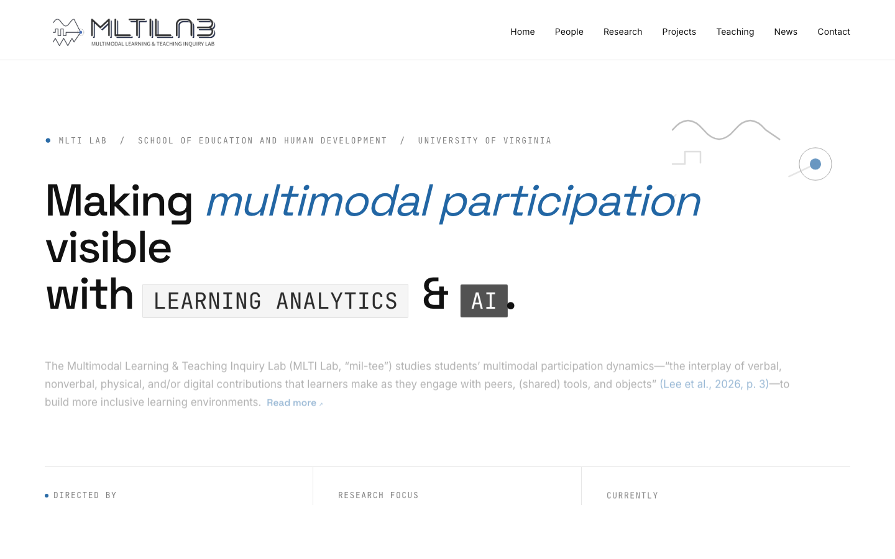
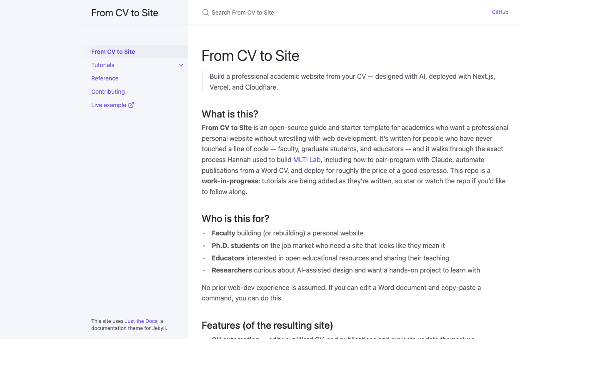

# From CV to Site

> Build a professional academic website from your CV — designed with AI, deployed with Next.js, Vercel, and Cloudflare.

## What is this?

**From CV to Site** is an open-source guide and starter template for academics who want a professional personal website without wrestling with web development. It's written for people who have never touched a line of code — faculty, graduate students, and educators — and it walks through the exact process Hannah used to build [MLTI Lab](https://mltilab.com), including how to pair-program with Claude, automate publications from a Word CV, and deploy for roughly the price of a good espresso. This repo is a **work-in-progress**: tutorials are being added as they're written, so star or watch the repo if you'd like to follow along.

## Who is this for?

- **Faculty** building (or rebuilding) a personal or lab website
- **Ph.D. students** on the job market who need a site that looks like they mean it
- **Educators** interested in open educational resources and sharing their teaching
- **Researchers** curious about AI-assisted design and want a hands-on project to learn with

No prior web-dev experience is assumed. If you can edit a Word document and copy-paste a command, you can do this.

## Features (of the resulting site)

- **CV automation** — edit your Word CV, and publications and projects update themselves
- **Fully responsive** — works on mobile, iPad, and desktop out of the box
- **Editorial typography** — styled for academic content, not startup landing pages
- **Free hosting** via Vercel
- **Custom domain** for ~$15/year (optional, highly recommended)
- **Built with Claude** — AI pair-programming throughout, documented step by step

## Live Example

See **[MLTI Lab](https://mltilab.com)** — built using this approach.

[](https://mltilab.com)

## The starter

The [`starter/`](starter/) directory is a working reference implementation of the stack. Fork or copy it to begin; Tutorials 3 through 7 build against it.


```bash
git clone https://github.com/HakeoungLee/from-cv-to-site.git
cp -r from-cv-to-site/starter ~/dev/my-site
cd ~/dev/my-site
pnpm install
pnpm cv:sample   # write a sample CV
pnpm cv:update   # parse it into typed data
pnpm dev         # http://localhost:3000
```

See the [starter README](starter/README.md) for a full tour.

## Quick reference

See [REFERENCE.md](REFERENCE.md) for commands, file layout, entry formats, and troubleshooting at a glance.

## Documentation site

The full tutorial series is also browsable at [hakeounglee.github.io/from-cv-to-site](https://hakeounglee.github.io/from-cv-to-site/) with sidebar navigation and search.



## Tutorials

The tutorial series is organized as technical documentation. Read in order on first pass; return to specific tutorials as reference.

1. [**Why Build Your Own Site?**](tutorials/01-why.md) — scope, requirements, and tradeoffs
2. [**Designing with AI (Claude)**](tutorials/02-designing-with-ai.md) — producing a written design brief
3. [**Tech Setup**](tutorials/03-tech-setup.md) — installing Node.js, pnpm, Git, and Claude Code
4. [**Building the Pages**](tutorials/04-building-pages.md) — Next.js project structure and page templates
5. [**CV Automation**](tutorials/05-cv-automation.md) — parsing a Word CV into typed data and BibTeX
6. [**Deploying**](tutorials/06-deploying.md) — Vercel, custom domain, DNS, redirects, and analytics
7. [**Maintaining & Extending**](tutorials/07-maintaining.md) — routine updates, dependency management, and extensions

## Workshops

Live workshops are being planned (dates TBD). Check back here for announcements, or open an issue if you'd like to be notified.

## About the Author

**Hakeoung Hannah Lee** is an Assistant Professor at the University of Virginia (School of Education and Human Development). She built the MLTI Lab website while traveling between conferences, using AI tools and a lot of coffee.

Visit [mltilab.com](https://mltilab.com).

## Contributing

This is a work-in-progress, and feedback is very welcome:

- **Open an issue** for questions, suggestions, or things that didn't make sense
- **Fork the repo** and share your own adaptations — seeing other academics' sites is the best part
- **Get in touch**: [hannahlee@virginia.edu](mailto:hannahlee@virginia.edu)

See [CONTRIBUTING.md](CONTRIBUTING.md) for details, including how to contribute without using the terminal.

## License

MIT License — you're free to use, fork, and adapt this work. Please retain the copyright notice and include the license in redistributions, as required by MIT. See the [LICENSE](LICENSE) file for details.
