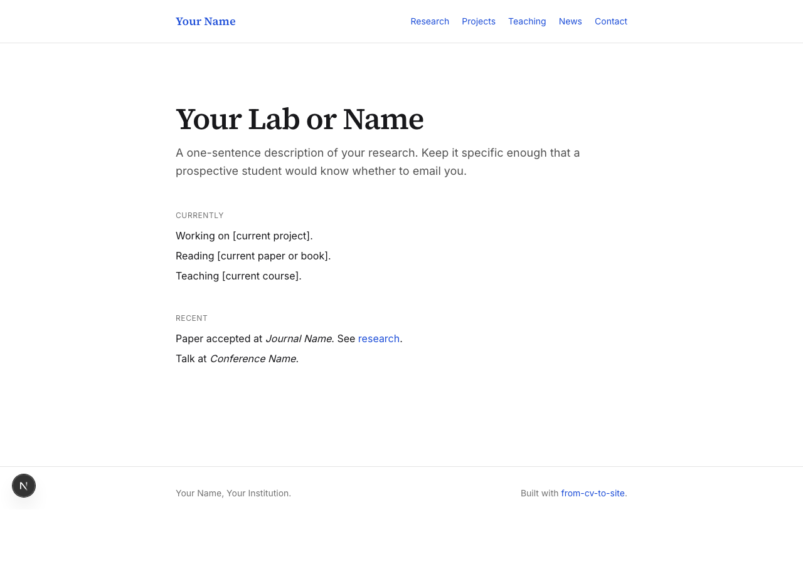
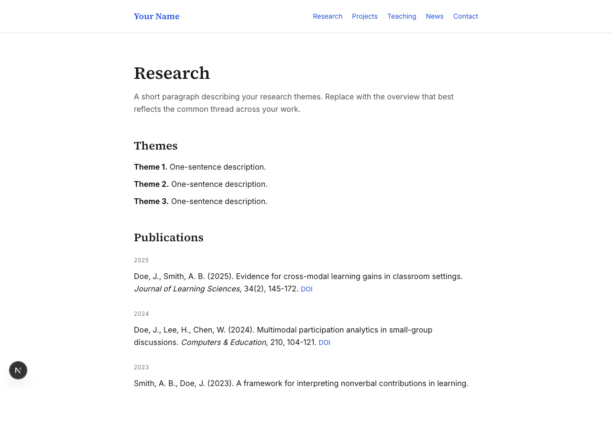

# 4. Building the Pages

> Part 4 of the [From CV to Site](../README.md) tutorial series.

## Prerequisites

- Completed [Tutorial 3](03-tech-setup.md)
- A design brief from [Tutorial 2](02-designing-with-ai.md)

## What this tutorial produces

A working Next.js project with the standard academic site pages, running locally at `http://localhost:3000`. Deployment is covered in Tutorial 6.

## Two paths through this tutorial

You can follow this tutorial in one of two ways:

**Option A: fork the starter.** Copy the [`starter/`](https://github.com/HakeoungLee/from-cv-to-site/tree/default/starter) directory from this repository as your starting point. All the scaffolding below is already done; you only need to replace the placeholder content. This is the fastest path and the recommended one if this is your first Next.js project.

```bash
git clone https://github.com/HakeoungLee/from-cv-to-site.git
cp -r from-cv-to-site/starter ~/dev/my-site
cd ~/dev/my-site
pnpm install
pnpm dev
```

**Option B: build from scratch.** Use the step-by-step instructions below to understand each file. Use this option if you already know Next.js and want full control, or if you want to understand what the starter contains before using it.

The rest of this tutorial walks through Option B. If you chose Option A, skim to verify the project layout matches and then move to Tutorial 5.

## Site structure overview

The following page structure is recommended for a lab or personal academic site. Omit pages that do not apply.

| Route | Purpose |
|---|---|
| `/` | Home: identity, short intro, current focus |
| `/research` | Research themes and publications |
| `/projects` | Ongoing and past projects |
| `/teaching` | Courses and teaching materials |
| `/people` | Lab members (labs only) |
| `/news` | Recent announcements and updates |
| `/contact` | Contact information and affiliations |

## Creating the Next.js project

Create the project from a clean terminal in a folder where you keep code (for example, `~/dev`).

```bash
cd ~/dev
pnpm create next-app@latest my-site --typescript --tailwind --eslint --app --src-dir --import-alias "@/*"
cd my-site
```

Answer `Yes` to TypeScript, Tailwind CSS, ESLint, App Router, and the `src/` directory when prompted. These defaults match the rest of the series.

Start the development server to verify installation:

```bash
pnpm dev
```

Open [http://localhost:3000](http://localhost:3000). You should see the Next.js starter page. Stop the server with `Ctrl+C`.

## File organization

The project uses the Next.js App Router. Key directories:

```
my-site/
├── src/
│   ├── app/
│   │   ├── layout.tsx        # root layout: header, footer, fonts
│   │   ├── page.tsx          # home page
│   │   ├── research/
│   │   │   └── page.tsx
│   │   ├── projects/
│   │   │   └── page.tsx
│   │   ├── teaching/
│   │   │   └── page.tsx
│   │   ├── people/
│   │   │   └── page.tsx
│   │   ├── news/
│   │   │   └── page.tsx
│   │   └── contact/
│   │       └── page.tsx
│   ├── components/           # reusable UI components
│   ├── data/                 # generated data files (Tutorial 5)
│   └── lib/                  # utilities
├── public/                   # static assets (images, PDFs)
├── tailwind.config.ts
└── next.config.ts
```

Create the page folders now:

```bash
cd src/app
mkdir research projects teaching people news contact
```

## Creating pages with Claude Code

Start Claude Code from the project root. Paste your design brief from Tutorial 2 at the start of the session. Request one page at a time.

Example request for the home page:

> Create `src/app/page.tsx` as the home page. It should use the fonts and colors defined in the design brief above. Include: a short headline, a two-sentence introduction, and a "current focus" section. Use semantic HTML and Tailwind utility classes. No client-side JavaScript unless required.

Review the generated file before accepting. Adjust copy and Tailwind classes as needed. Repeat for each route.

## Building the home page

A minimal home page skeleton:

```tsx
// src/app/page.tsx
export default function Home() {
  return (
    <main className="mx-auto max-w-3xl px-6 py-16">
      <h1 className="text-4xl font-serif mb-4">
        Your Lab or Name
      </h1>
      <p className="text-lg text-neutral-700 mb-12">
        One or two sentences describing your research.
      </p>
      <section>
        <h2 className="text-sm uppercase tracking-wider text-neutral-500 mb-2">
          Currently
        </h2>
        <p className="text-base">
          What you are working on right now.
        </p>
      </section>
    </main>
  );
}
```

Replace placeholder text with your own content.

## Building the research page

The research page typically contains research themes and a publications list. Publications are generated in Tutorial 5; use a placeholder array for now.

```tsx
// src/app/research/page.tsx
export default function Research() {
  return (
    <main className="mx-auto max-w-3xl px-6 py-16">
      <h1 className="text-3xl font-serif mb-8">Research</h1>
      <section className="mb-12">
        <h2 className="text-xl font-serif mb-4">Themes</h2>
        <ul className="space-y-3 text-neutral-700">
          <li><strong>Theme 1.</strong> Short description.</li>
          <li><strong>Theme 2.</strong> Short description.</li>
        </ul>
      </section>
      <section>
        <h2 className="text-xl font-serif mb-4">Publications</h2>
        <p className="text-neutral-500">Generated in Tutorial 5.</p>
      </section>
    </main>
  );
}
```

## Adding the remaining pages

Use the same pattern for `projects`, `teaching`, `people`, `news`, and `contact`. Each page file exports a default React component that returns the page's content.

For the contact page, include your institutional email, office location, and links to external profiles (Google Scholar, ORCID, etc.).

## Root layout

The root layout at `src/app/layout.tsx` defines the header, footer, and fonts that appear on every page.

```tsx
// src/app/layout.tsx
import type { Metadata } from "next";
import "./globals.css";
import Header from "@/components/Header";
import Footer from "@/components/Footer";

export const metadata: Metadata = {
  title: "Your Name",
  description: "Your Lab or research description",
};

export default function RootLayout({
  children,
}: {
  children: React.ReactNode;
}) {
  return (
    <html lang="en">
      <body className="antialiased">
        <Header />
        {children}
        <Footer />
      </body>
    </html>
  );
}
```

Create `Header` and `Footer` components in `src/components/`.

## Navigation

A minimal header with site navigation:

```tsx
// src/components/Header.tsx
import Link from "next/link";

export default function Header() {
  return (
    <header className="border-b border-neutral-200">
      <nav className="mx-auto max-w-3xl px-6 py-4 flex justify-between">
        <Link href="/" className="font-serif">Your Name</Link>
        <ul className="flex gap-6 text-sm">
          <li><Link href="/research">Research</Link></li>
          <li><Link href="/projects">Projects</Link></li>
          <li><Link href="/teaching">Teaching</Link></li>
          <li><Link href="/news">News</Link></li>
          <li><Link href="/contact">Contact</Link></li>
        </ul>
      </nav>
    </header>
  );
}
```

## Footer

```tsx
// src/components/Footer.tsx
export default function Footer() {
  return (
    <footer className="border-t border-neutral-200 mt-16">
      <div className="mx-auto max-w-3xl px-6 py-8 text-sm text-neutral-500">
        <p>Your Name, Your Institution.</p>
      </div>
    </footer>
  );
}
```

## Typography setup

Next.js provides built-in font loading via `next/font`. Configure in the root layout:

```tsx
import { Inter, Source_Serif_4 } from "next/font/google";

const sans = Inter({ subsets: ["latin"], variable: "--font-sans" });
const serif = Source_Serif_4({ subsets: ["latin"], variable: "--font-serif" });

export default function RootLayout({ children }: { children: React.ReactNode }) {
  return (
    <html lang="en" className={`${sans.variable} ${serif.variable}`}>
      <body>{children}</body>
    </html>
  );
}
```

Reference `var(--font-serif)` and `var(--font-sans)` in your Tailwind configuration or inline classes.

## Responsive considerations

The examples use `max-w-3xl` to constrain line length for readability. Tailwind's default breakpoints (`sm`, `md`, `lg`) are sufficient for most academic sites. Test at three widths:

- Mobile: 375px (iPhone)
- Tablet: 768px (iPad portrait)
- Desktop: 1440px and above

Use Chrome DevTools' device toolbar (`Cmd+Option+I`, then device icon) to verify each breakpoint.

## Local preview

Run the dev server and navigate through each page:

```bash
pnpm dev
```

Visit `http://localhost:3000`, `/research`, `/projects`, `/teaching`, `/people`, `/news`, and `/contact`. Resolve any broken links or type errors before proceeding.

The starter renders as follows on first run (before replacing placeholder content):



Research and projects pages are populated from data generated in Tutorial 5:



## Committing progress

Initialize a Git repository and commit your progress:

```bash
git add .
git commit -m "Scaffold pages and layout"
```

## Next tutorial

[Tutorial 5: CV Automation](05-cv-automation.md)

---

*Questions or feedback: open an issue on the [repository](https://github.com/HakeoungLee/from-cv-to-site) or email [hannahlee@virginia.edu](mailto:hannahlee@virginia.edu).*

[Back to README](../README.md)
